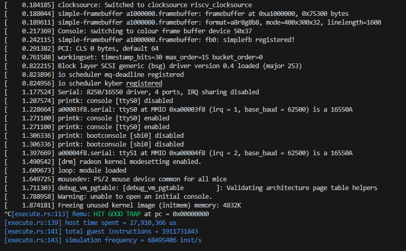

# REMU - Rust RISC-V Emulator

[中文版](README_CN.md)

Re-implementation of the [NEMU](https://github.com/NJU-ProjectN/NEMU) project from Nanjing University (ICS course) using Rust. It can successfully boot RT-Thread/Linux. The current Linux boot speed is ~70 MIPS.



## Development Environment

- Mac Mini M4

## Software Versions

- OpenSBI 1.8.1
- Linux 5.15

## Supported ISA

- RV32IMA_Zicsr_Zifencei

## Quick Start

1. Install Dependencies

   macOS:

   ```bash
   brew install rust sdl2 dtc
   ```

   Linux (Ubuntu/Debian):

   ```bash
   sudo apt install cargo libsdl2-dev device-tree-compiler
   ```

2. Build Project

   ```bash
   # Debug build
   cargo build

   # Release build
   RUSTFLAGS="-C target-cpu=native" cargo build --release
   ```

3. Run Linux

   Use pre-compiled OpenSBI and Linux images (need to prepare yourself or refer to `linux-sw` for building):

   ```bash
   # Run Linux Payload
   ./target/release/remu --image /path/to/fw_payload.bin
   ```